# **_THIS PROJECT IS CURRENTLY IN PROGRESS - PLEASE DON'T USE IT YET._**


## This is a tutorial on how to host your own website on a Raspberry Pi by using your own domain.

Did you ever asked yourself how to host a website without having to pay those expensives hosts and try to spend as less money as possible, without having to keep your computer on all day to host a website? \
If yes, then this page is for you.

## Table of contents:

1. [What will you learn from this?](#1-what-will-you-learn-from-this)
2. [FAQ](#2-faq)
3. [Requirements](#3-requirements)
4. [Installation - Ubuntu OS on Raspberry Pi](#4-installation---ubuntu-os-on-raspberry-pi)
5. [Minor Tweaks - Desktop OS Only](#5-minor-tweaks---dekstop-os-only)
6. [Installing NGINX](#6-installing-nginx)
7. [Control Panel Installation.](#7-control-panel-installation.)\
   7.1 [Control Panels Comparison Table](#71-control-panels-comparison-table)\
   7.2 [More Documentation Links](#72-more-documentation-links)\
   7.3 [Personal Choice](#73-personal-choice)\
   7.4 [aaPanel Installation](#74-aapanel-instalation)\
   7.5 [aaPanel Configuration](#75-aapanel-configuration)\
   7.6 [aaPanel Website Creation.](#76-aapanel-website-creation76)
8. [Port Forwarding](#8-port-forwarding)
9. [Domain Registration & DNS Records.](#9-domain-registration--dns-records)

## 1. What will you learn from this?

- How to install Ubuntu on SSD by using SATA to USB3 Adapter.
- Install NGINX on your Raspberry PI.
- Install a control panel for your website.
- How to point your Domain to your Raspberry Pi IP.
- How to make your website public through port forwarding.
- Secure both your website and your control panel with firewalls and protection.
- Automate emergency notifications. If something happens with your host, panel, etc, you will get a notification on your phone via Telegram, Discord, Email, etc.

## 2. FAQ:

```
Why can't I use an SD Card like all Pi users do?
```

Switching a Raspberry Pi from a microSD card to an SSD massively boosts read/write speeds, improves long-term reliability, and prevents data corruption during unexpected power loss. In other words, your SD Card may always corrupt unexpectedly and makes you lose all your work, and it's slower.

```
Is it worth it?
```

If you don't want to spend 10£/month for a basic web host, yes. Unlike normal hosting, where you pay 10£/month for ONE website, with Raspberry Pi and NGINX you can host multiple websites without paying anything. (except for domains)

```
Do I need to know linux commands?
```

Not necessarily. I highly recommend you learn ubuntu terminal commands for long-term education. Linux is a must-know skill that every developer should touch at some point. You can't do anything on your computer if you don't even know how to turn it on, right?

## 3. Requirements:

- A computer with internet access (can be both laptop and desktop).
- A Raspberry Pi (preferably 4+. Anything under Pi 4 will have issues with SSDs).
- SATA to USB3 Adapter.
- Raspberry Pi Power Supply.
- SSD (250+GB Recommended for long-term scalability).
- SD Card (4GB+) - We won't need this for long.
- SD Card to USB Adapter. There are many choices and models online, they are all the same, as long as they do the job.
- Raspberry Pi 7" Touchscreen (optional, totally not needed for our project but useful if you want to have a weather station, Home Assistant Implementations etc.)
  

## 4. Installation - Ubuntu OS on Raspberry Pi.

To install Ubuntu on your Raspberry Pi you will need:

- Raspberry Pi Imager. [Download from Official Website](https://www.raspberrypi.com/software/)
- SATA to USB3 Adapter.
- SSD (250GB+ Recommended for scalability and huge websites with lots of images).

**INSTALLATION STEPS**

1. Download Raspberry Pi imager.
2. Install it.
3. Connect your SD Card to your computer.\
   > In my case, the SD Card is mounted on (J:)\
   > 
4. Open Raspberry Pi Imager. \
   You will now see this:
   
   > If you see random characters like mine (? NNMNROMLQ), just ignore them. I don't know why it looks like that, it might be from my side only.
5. Choose your device. In my case, I am using a Raspberry Pi 4, so I will chose the second option.
6. Click Next (or LCVR in my case - don't ask, I dont know why it looks like this.)\
   
7. In the OS menu, we have to install a bootloader on the SD Card first. Scroll down until you find **_MISC UTILITY IMAGES_** and click on it. It should take you to the next section. If it doesn't, just click **_NEXT_**\
   
8. Select **_Bootloader (Pi 4 Family)_**.
   > It might say something else depending on the Pi you're using.\
   > 
9. Select **_Select USB Boot_** and click next.
   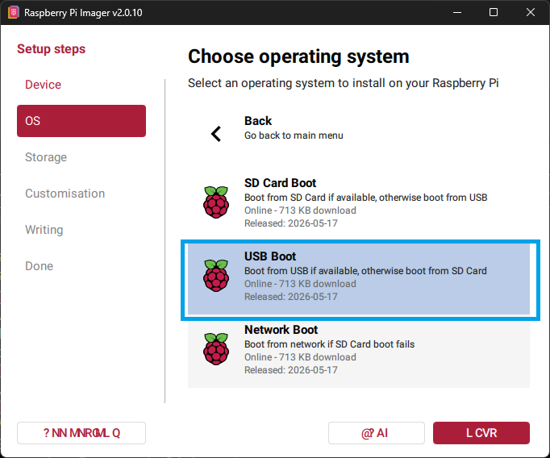

10. Select the SD Card you have connected to your PC in **_step 3_**, and click next.
    > Since mine is in J: and it's a 32gb SD Card, I will select the second option.\
    > 
11. Double check the details and make sure they match, and click next. **_You must make sure the Operating system is USB BOOT_**.\
    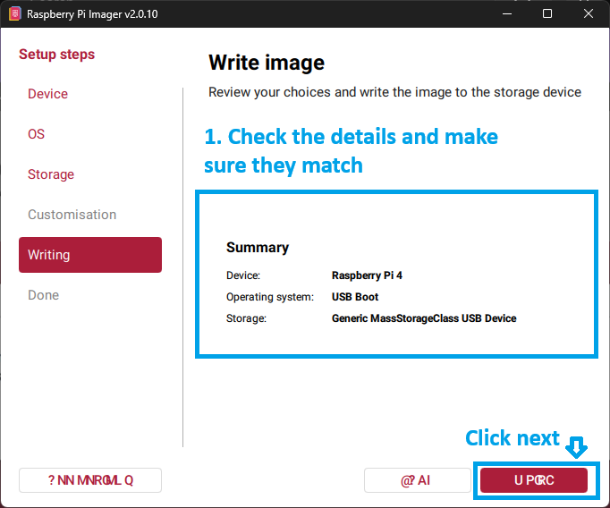
12. Make sure you understand that **once you write the image, everything will be erased on that SD Card**, and click the red button.\
    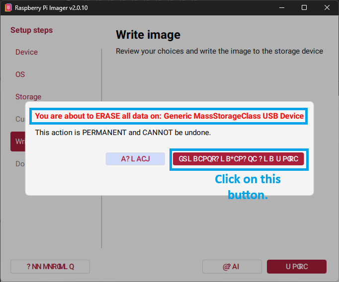

13. Wait for the Imager to write the image on the SD Card.
14. Once completed, you will see this screen. Click on the red button to close the app and **eject the SD Card**.\
    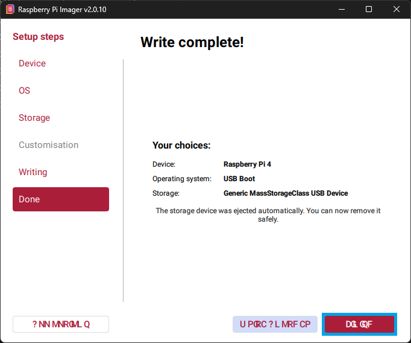

15. Insert the SD Card into your Raspberry Pi.\
    
16. Power on your Raspberry Pi by plugging the power cable in the USB C Power Supply.\
    
17. Once the Pi has been turned on, it will now copy the bootloader code into the Raspberry Pi. **Keep an eye on the green LED**. Once it's finished you will see the green LED flashing continuously.
    On the other hand, if you have a screen connected to your Raspberry Pi via HDMI, you will see a green screen. That is totally normal. On the following image, the green LED is marked as "ACT".\
    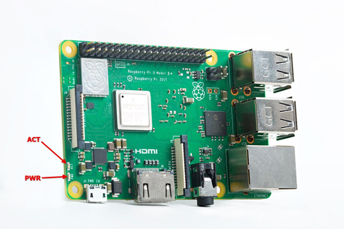
18. Once the green LED starts flashing, you can now unplug the power supply from the Raspberry Pi. **_Make sure you unplug the power cable, and NOT the SD Card._**
19. Only after powering off, you can now safely remove the SD Card. We won't need it anymore.
20. Connect your SSD to your PC using the SATA to USB3 adapter.\
    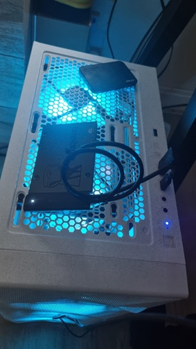
    > If you are getting a message to format the SSD, don't worry about it, you can ignore it. The Pi Imager software will format it anyway.
21. Open **Raspberry PI Imager**.
22. Select your Pi Model once again and click **next** (Again, my Pi is _Raspberry Pi 4_).
    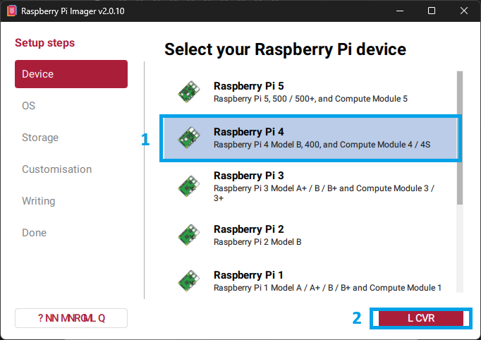
23. Select the desired OS. **Since I am using a monitor for my Raspberry Pi 4, I will install the Desktop version (64-Bits).** If you're planning to use a monitor, it can be a simple HDMI monitor or a Pi touchscreen.
24. After selecting your desired OS, click next.
    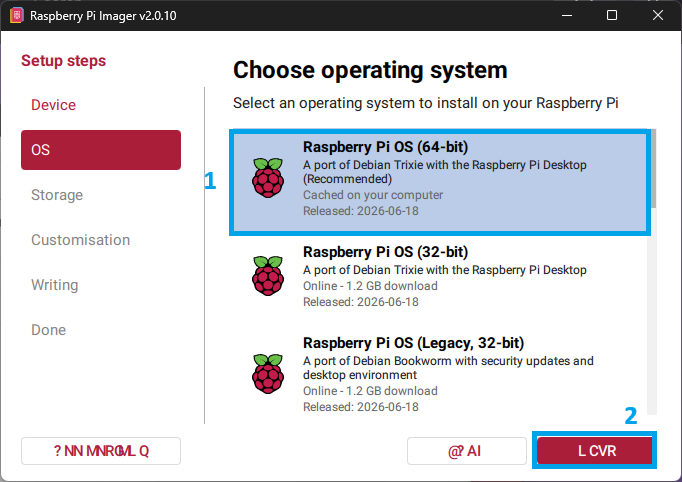
25. Select your SSD from the Storage menu and click Next. **In my case, I am using a KINGSTON SSD**. Your device name will most likely be different.
    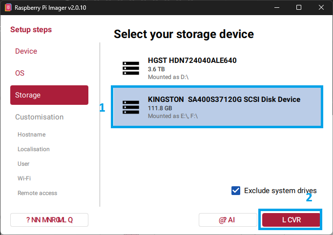
26. **Customisation: Choose Hostname -** Choose the desired hostname for the Raspberry Pi and click Next. _This can be any name you wish, but make sure to remember it. **We will later use this hostname to connect via ssh** and see it in our internet router._
    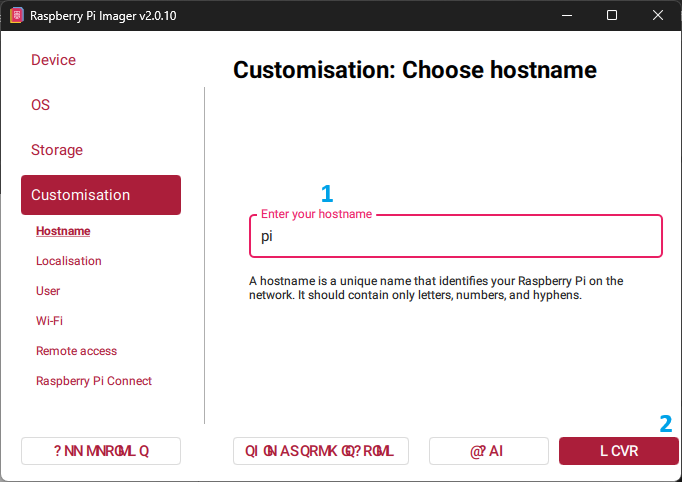
27. **Customisation: Localisation -** Set your Localisation and click next. This is used to set the time zone and keyboard layour for your Raspberry Pi. _In my case, I will use London as Capital City, Europe/London Time zone and GB Keyboard Layout as I live in UK._
    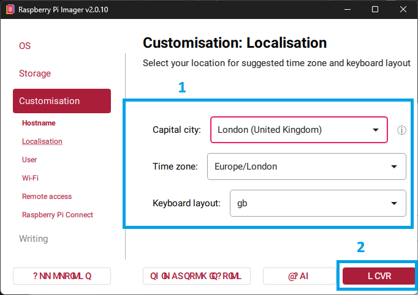
28. **Customisation: Choose Username -** Set your username and password for your Raspberry Pi and click **Next**. This will be used to log into your OS (just like in Windows). _Make sure you remember the password._
    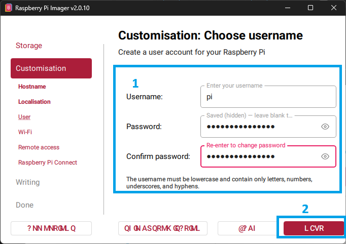
29. **Customisation: Choose Wi-Fi -** Enter your Wi-Fi SSID and Password and click **Next**. This will connect your Raspberry Pi to your Wi-Fi.
    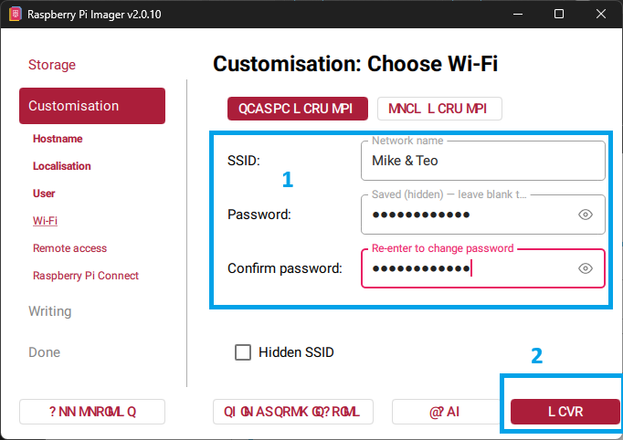
30. **Customisation: SSH Authentication -** Enable your SSH Autenthication and click **Next**. This will allow us to connect to our Raspberry Pi remotely. _I recommend using the **Use password authentication** for easier access._
    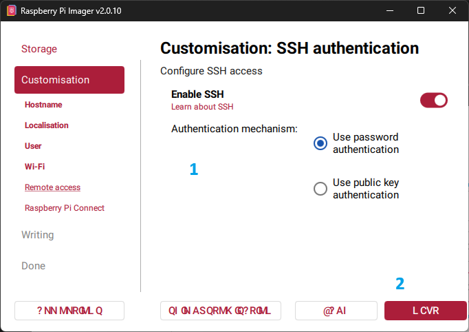
31. **Customisation: Raspberry Pi Connect -** IF YOU ARE USING A MONITOR, I recommend using the Raspberry Pi Connect to connect to your Pi and control the desktop remotely. If you don't have a Desktop OS, you can skip this step.\
    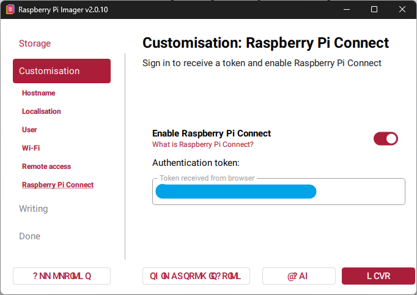
    > NOTE: You will need to create an account on the Raspberry Pi website in order to receive an Authentication Token.
32. **Write Image -** Review all the settings and click **Next**. This will now write the image on the connected SSD.  
    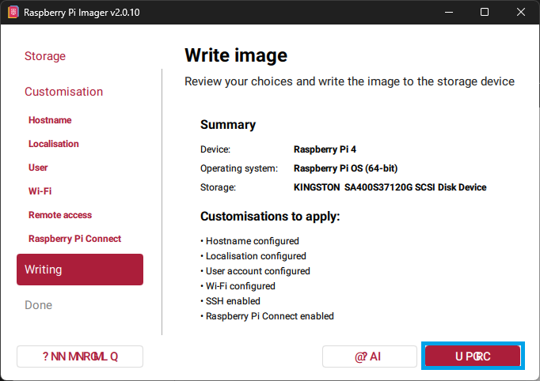
33. Wait for the installation. This should take a minute or two. _Grab a coffee, we'll be here for longer.._
    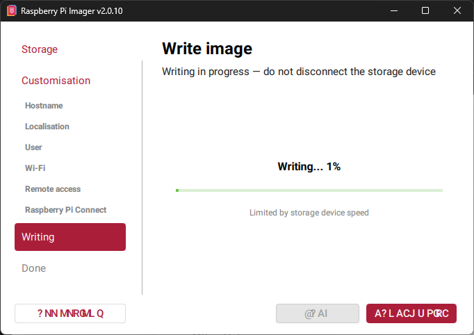
34. Once finished, click on the **Finish** red button (or whatever it says.)
    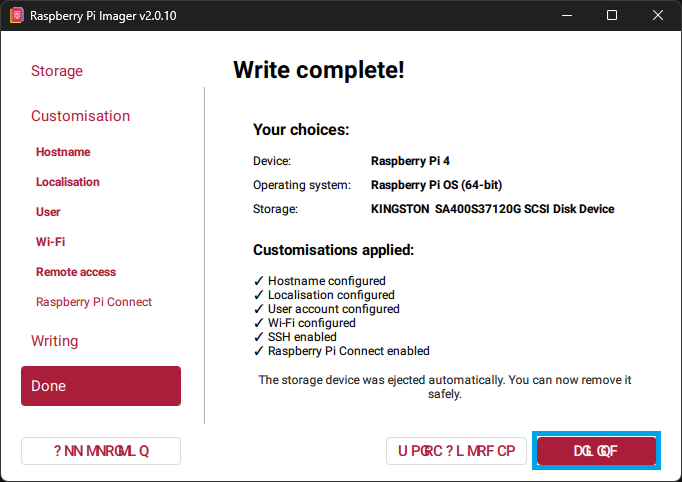
35. Remove the SSD from the Computer.
36. **Make sure the Raspberry Pi has no SD card inside and it's completely powered off.**
37. Connect the SDD to the Raspberry Pi via SATA to USB3 adapter into a USB3 Port **(blue USB)**
    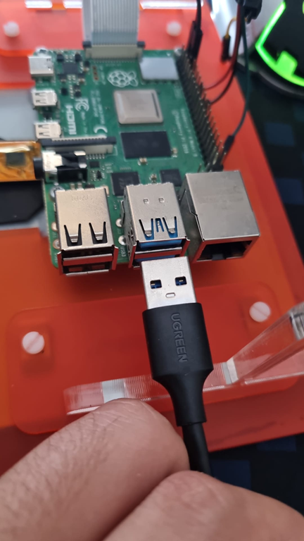
38. Power the Pi by inserting the USB-C cable into the USB-C power port. **_(Check the image on Step 16)_**
39. Wait for the Pi to Boot. If you're using a screen, you will see when it finishes booting. If not, just wait a minute.
    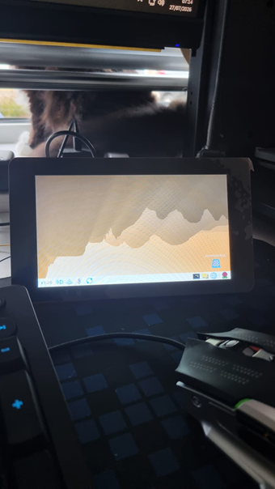

**CONGRATULATIONS!**\
You have successfully installed an OS on your SSD and connected it to your raspberry pi!\
However, there are still some tweaks we have to do in order to be happy with our Pi.

## 5. Minor Tweaks - Dekstop OS ONLY.

If you've noticed, your monitor will most likely be upside down.\
You can use your finger to manually rotate the screen. All you have to do is:

1. Open the Activities overview and type Displays.
2. Click Displays to open the panel.
3. Select your target display in the preview area.
4. Click Orientation and choose your preferred setting:\
   -Landscape (Normal)\
   -Portrait Left (90 degrees counter-clockwise)\
   -Portrait Right (90 degrees clockwise)\
   -Landscape (flipped) (180 degrees upside down)\
5. Click Apply and select Keep Changes.

Otherwise, you can connect to your Raspberry Pi by using _Raspberry Pi Connect_.\

1. Head to [Raspberry Pi Connect Official Website](https://www.raspberrypi.com/software/connect/).
2. Create an account or Login.
3. Once you managed to create your account or login, you should see your device in the following menu.\
   Click on **Connect Via** and select **Screen Sharing**.
   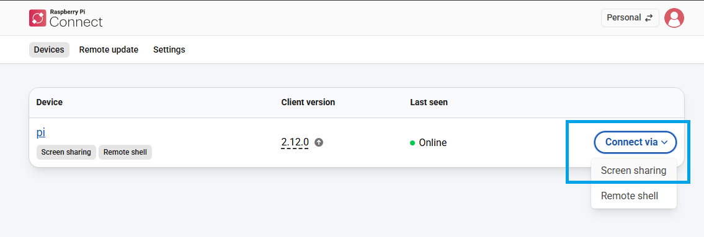
4. A new browser window will open and you will be connected to your Raspberry Pi. Now you can control it like a normal computer.
5. Head over to **Pi Icon > Preferences > Control Centre**
   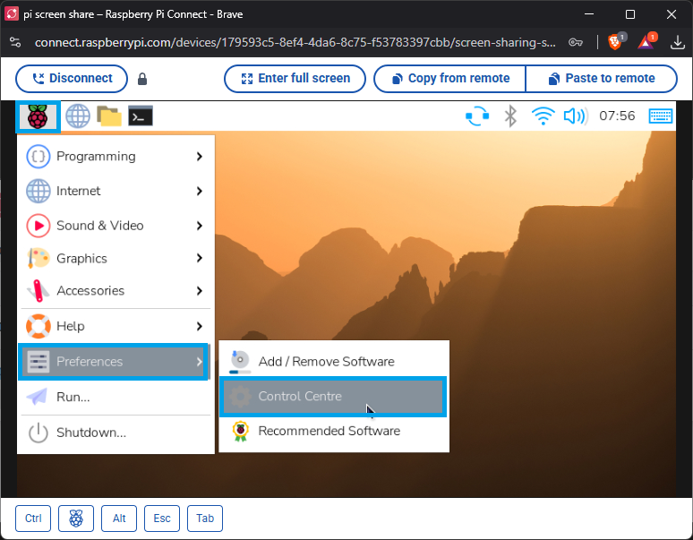
6. On the left side, scroll down until you find **"Screens"**. Select your monitor (it should be **DSI-1**) > **Orientation** > Click on **Inverted** and finally click on **Apply**.
   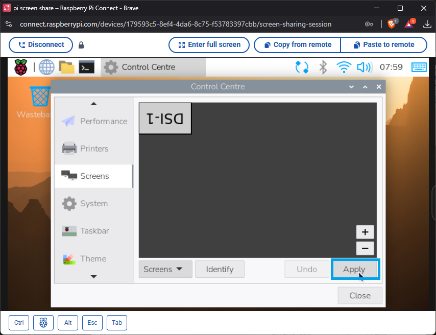
7. The screen will now look normal again.
   > If your mouse is now inverted in the Browser Page, it's totally normal. We'll get it fixed in the next step.
8. Close the browser page.

**Congratulations! Now your monitor is not inverted anymore!**

## 6. Installing NGINX.

From this point forward, we'll work on SSH from our personal computer.
I am using [WSL - Windows Subsystem for Linux](https://learn.microsoft.com/en-us/windows/wsl/install) on my Windows 11 machine. This allows me to have Ubuntu freedom and power directly on my personal machine without having to dual-boot.\
**If my pictures look different from your terminal, is because I have modified my terminal to look better. Don't worry, this doesn't change any commands we'll use.**

1. Open _Command Prompt_ **or** _Terminal_ on our PC.
2. Connect to our Pi by using **_SSH_**. In my case, my username and host is _pi@pi_, but yours will be the same ones you have set up during steps **26, 28**.
   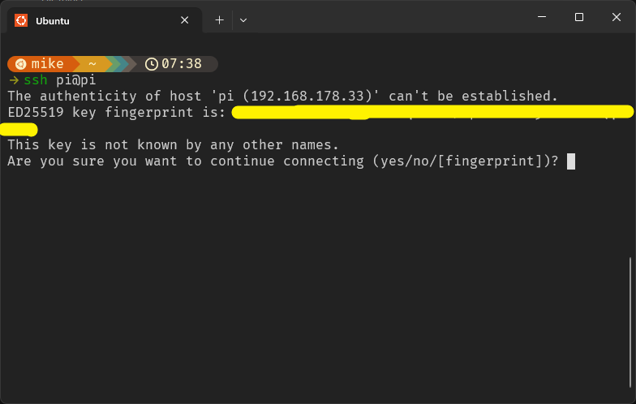
   When asked if you want to continue, type "yes" and press **enter**.
3. Enter the password **you have set up for your pi** and press **enter**.
   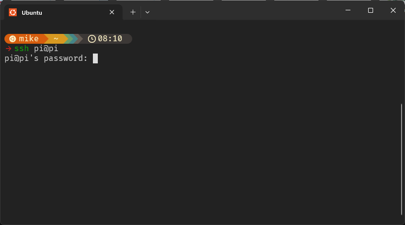
   > Note: You won't see your password when you're typing it. It's completely normal.
4. Notice the terminal is now showing us as _user@host_. That means we are now connected to the Pi and controlling it. **We are no longer in Windows Command Prompt, but we are in Ubuntu!**.
   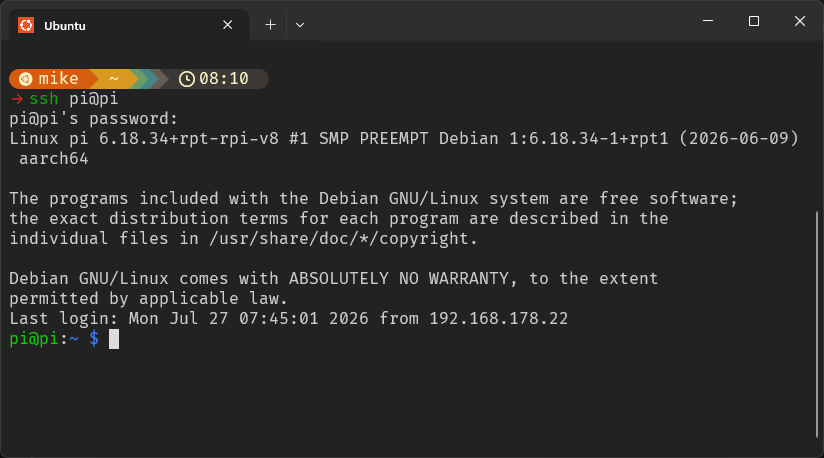
5. Time to update our OS. Type the following commands and press **enter** after each command. **Enter the password if prompted**.

```
sudo apt update
sudo apt upgrade
```

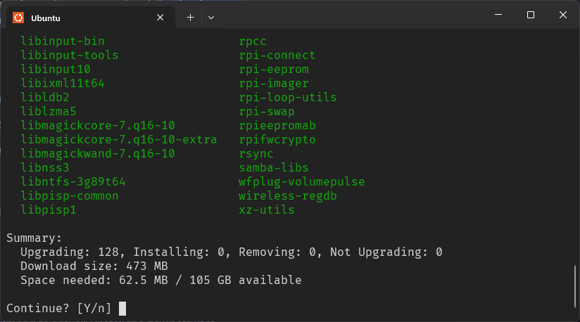

> If asked if Continue, type "Y" and press enter.
> The OS is now getting updated. Wait until it finishes. This is the equivalent of updating your Windows.
> 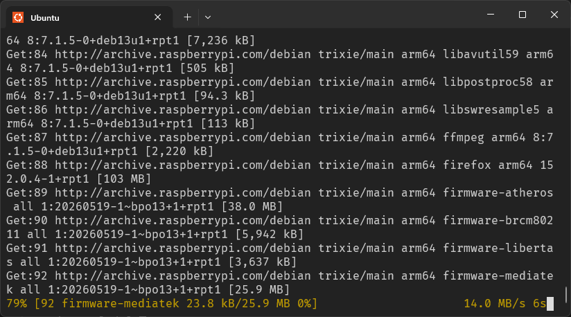

6. To install NGINX, type the following commands and press **Enter** (**Remember to type "Y" and press enter if asked to continue**)

```
sudo apt install nginx
```

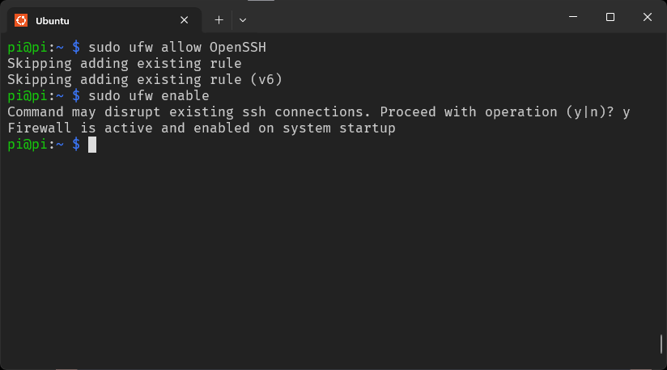 7. Check your NGINX is up and running. Type the following command. You should see a similar output like in my picture.

```
systemctl status nginx
```

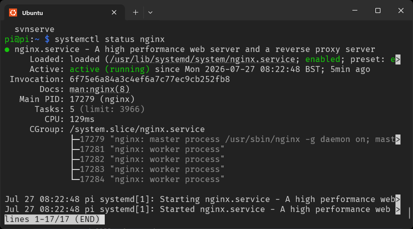 8. Press **CTRL+C** to leave the NGINX output. 9. To test your own NGINX page, you first need to get your own public IP. If you don't know it, use the following command.

```
curl -4 icanhazip.com
```

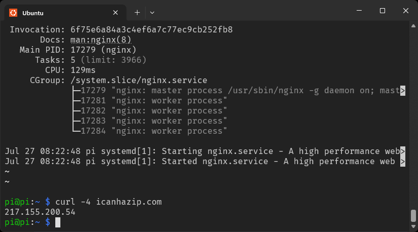

> It will return your public IP. You can now copy and paste that IP into your browser’s address bar:

```
http://your_server_ip
```

You should now see a page that looks like this:


**_Congratulations!_** You are now hosting your own website! However, we don't want people to look for our website by using an IP adress, right? In this case, get ready for the next step.

## 7. Control Panel Installation.

When it comes to choosing a Control Panel, there are multiple choices on the internet, each with their own PROs and CONs. It is important to make a good choice from the start, so you don't come back and start from scratch in case you're not satisfied with your Control Panel.

Here's a table with the most famous Control Panels available as well as some links for you to read and document yourself before taking action.

**_⚠️ NOTE ⚠️_** In this tutorial I will install aaPanel, therefore **all the commands used are for aaPanel only**. All other panels have their own commands in order to be installed, so please read the documentation on the desired panel you're willing to installed.

### 7.1 Control Panels Comparison Table

| 🛠️ Control Panel | 🔓 Open Source       | 🌐 Web Server Support        | 🐧 OS Support            | 📦 Docker / Containers | 📧 Email Hosting | 🌍 DNS Management | 🎯 Best Use Case            |
| ---------------- | -------------------- | ---------------------------- | ------------------------ | ---------------------- | ---------------- | ----------------- | --------------------------- |
| **aaPanel**      | ✅ Yes               | Nginx, Apache, OpenLiteSpeed | CentOS / Debian / Ubuntu | ✅ Yes                 | ✅ Yes           | ✅ Yes            | Easy LAMP/LNMP management   |
| **HestiaCP**     | ✅ Yes               | Nginx + Apache               | Debian / Ubuntu          | ⚠️ Community support   | ✅ Yes           | ✅ Yes            | Lightweight shared hosting  |
| **ISPConfig**    | ✅ Yes               | Apache, Nginx, Lighttpd      | Debian / Ubuntu / CentOS | ⚠️ Emerging support    | ✅ Yes           | ✅ Yes            | Multi-server shared hosting |
| **ApisCP**       | 🟡 Core OSS / 💰 Pro | Apache                       | CentOS / AlmaLinux       | ✅ Yes                 | ✅ Yes           | ✅ Yes            | Enterprise-grade hosting    |
| **Spikster**     | ✅ Yes               | Nginx                        | Linux VPS / Cloud        | ✅ Yes                 | ✅ Yes           | ✅ Yes            | Modern PHP app hosting      |
| **Virtualmin**   | ✅ Yes               | Apache / Nginx               | Debian / CentOS          | ⚠️ Partial             | ✅ Yes           | ✅ Yes            | Flexible enterprise panel   |
| **VitoDeploy**   | ✅ Yes               | Nginx                        | Ubuntu                   | ✅ Yes                 | ❌ No            | ❌ No             | Docker-first deployments    |
| **CyberPanel**   | ✅ Yes               | OpenLiteSpeed                | CentOS / Ubuntu          | ✅ Yes                 | ✅ Yes           | ✅ Yes            | High-performance hosting    |
| **Coolify**      | ✅ Yes               | Reverse proxy based          | Ubuntu / Debian          | ✅ Yes                 | ❌ No            | ❌ No             | Self-hosted PaaS            |
| **FASTPANEL**    | 🆓 Freeware          | Nginx                        | Debian / Ubuntu          | ⚠️ Limited             | ✅ Yes           | ✅ Yes            | Beginner-friendly hosting   |
| **CloudPanel**   | 🆓 Freeware          | Nginx                        | Debian / Ubuntu          | ✅ Yes                 | ❌ No            | ❌ No             | Cloud VPS PHP hosting       |
| **TinyCP**       | 🆓 Freeware          | Apache / Nginx               | Linux                    | ❌ No                  | ⚠️ Partial       | ⚠️ Partial        | Lightweight VPS admin       |
| **KeyHelp**      | 🆓 Freeware          | Apache / Nginx               | Debian / Ubuntu          | ❌ No                  | ✅ Yes           | ✅ Yes            | Traditional shared hosting  |

### 🔑 Legend

- ✅ **Yes**
- ❌ **No**
- ⚠️ **Limited / Partial support**
- 🟡 **Partially open source**
- 🆓 **Freeware (not fully open source)**
- 💰 **Paid / commercial option available**

### 7.2 More Documentation Links

Cloudpanel Article: [Cloudpanel Official Website](https://www.cloudpanel.io/blog/8-best-free-cpanel-open-source-alternatives/)\
Github Article by mic7811: [Github Link](https://github.com/mic7811/web-hosting-control-panels)\
aaPanel Article: [aaPanel Official Website](https://www.aapanel.com/blog/top-10-list-of-free-web-control-panels-and-their-key-features/)

### 7.3 Personal Choice

For my control panel, I chose to use **aaPanel**. This Panel has both a _free_ and a _paid_ version, however there aren't really that different. I will choose the **free version**. **_Why did I choose aaPanel?_**

#### Key features:

- One-Clipck App Installation.
- Resouirce Monitoring.
- Automated Backups.
- Open-source.
- Notifications automatisation.

#### Other features:

- It's free.
- It has quite a few plugins that are easy to install.
- Modern look & intuitive interface.
- Easy to understand and lightweight.

### 7.4 aaPanel Instalation

1. Connect to your Raspberry Pi via SSH **like you did in step 2** in **6. Installing NGINX**.
2. Type the following command:

```
sudo bash install_panel_en.sh ipssl
```

3. When prompted if you want to **install aaPanel to the /www directory**, type **_y_** and press enter.
   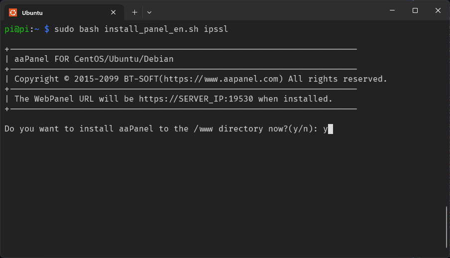 >⚠️ NOTE ⚠️\
   We will receive a message saying: _Web service is already installed_. That is **completely okay**, and it appears because we have already installed NGINX.\
   Type **yes** and press enter to continue the installation.
   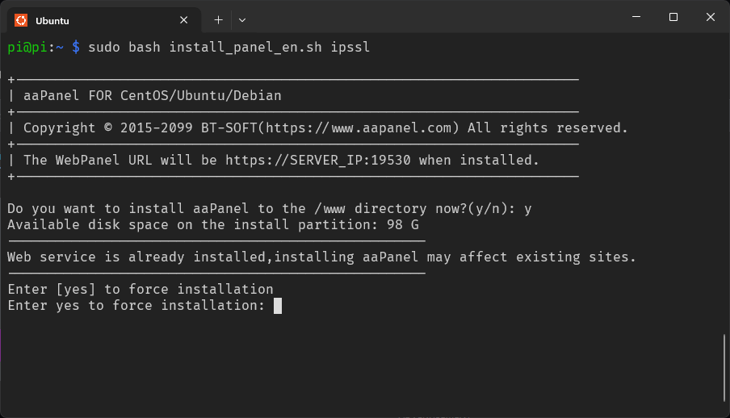

4. Wait for the installation. This will take about 15-20 minutes, so be patient and **DO NOT PRESS CTRL+C** - this will stop everything.
5. Once installation is done, you will see these messages:
   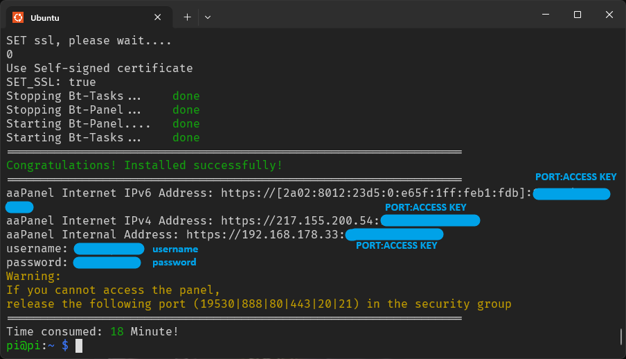
   > **Parts of the aaPanel URL has been censored. Those ports, access keys, username and password will be different, and they represent a security risk. Keep them safe and private.**
6. **_Congratulations!_** You have just installed **aaPanel** on your Raspberry Pi.

### 7.5 aaPanel Configuration

It is now time to **_access and configure_** the aaPanel. The username and password can be a bit annoying to remember, so let's go ahead and set them up however we like.

1. Click on the **aaPanel Internal Address Link.** (try ctrl+click if normal click doesn't work)
2. Your browser will now open the link. _If you're getting this message_, click on "Show Advanced" and click on "Proceed to x.x.x.x (unsafe).
   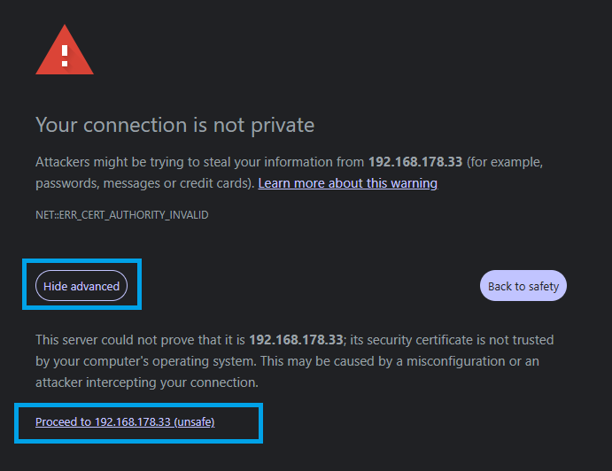
   > ⚠️ NOTE ⚠️: If there's no "Show Advanced" button, just click anywhere in the browser window and type "thisisunsafe" with no spaces.
3. Enter the username and password shown in the terminal to login, and click on the **Login** button.
   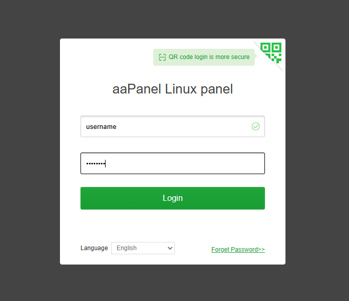
4. Click on Finish to close the successful installation message.
   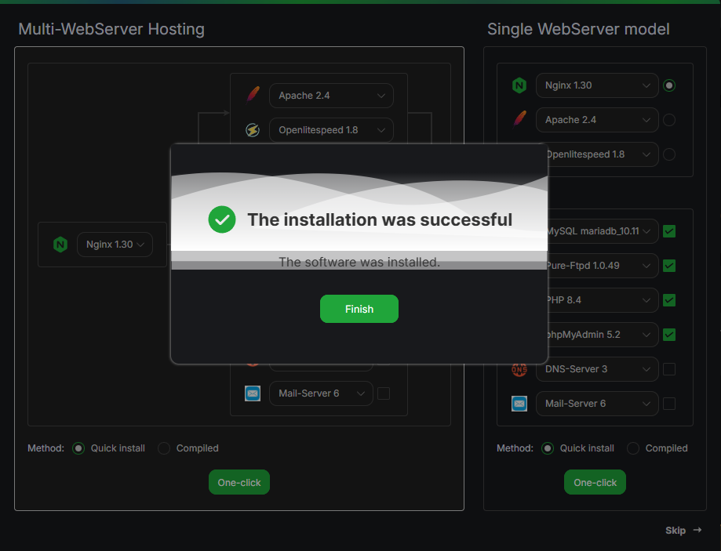
5. Click on "Skip" button for the WebServer Setup. We won't use this yet.
   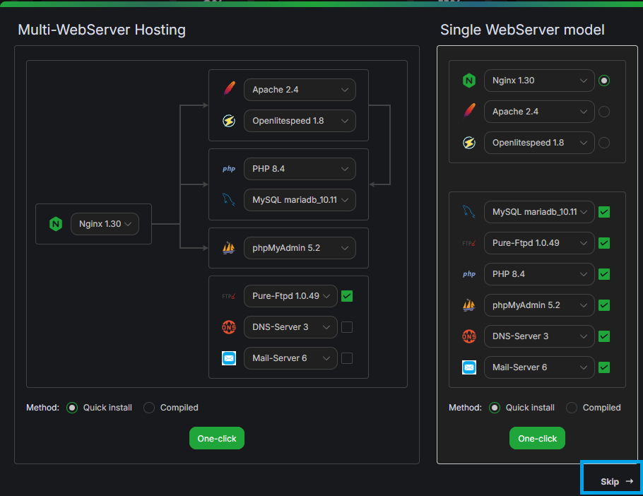
6. On the left-hand menu, scroll down and click on **Settings**. In the **Global** menu, find **Authentication & Security**, and click on "**Modify**" on Panel user.\
   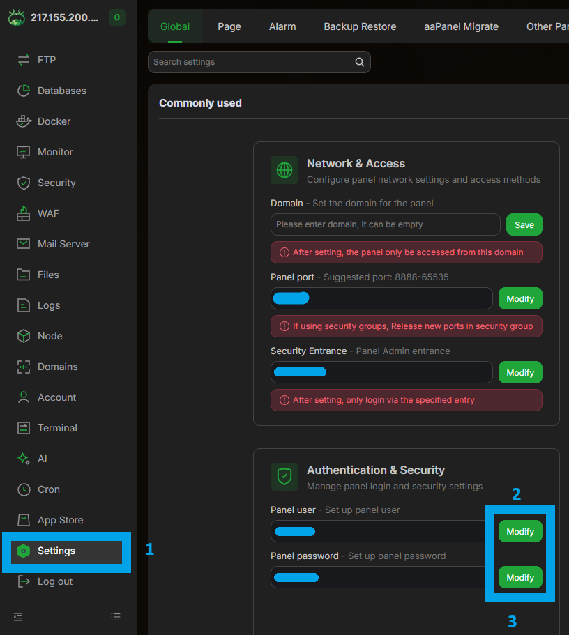
7. Enter your **new** username and the password **(from the terminal)**, then click on Confirm.\
   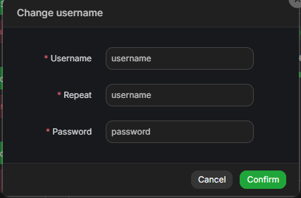
8. Login with your **new** username and **password** (from the terminal).\
   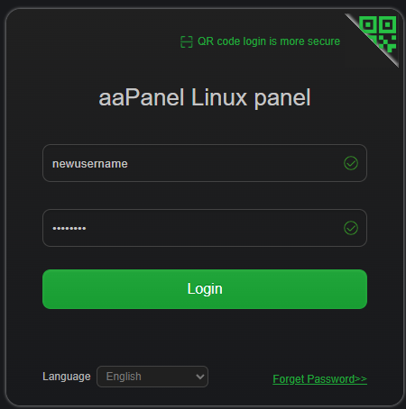
9. Head back to **Settings** > **Global** > **Authentication & Security**, and click on Panel Password > **Modify**.\
   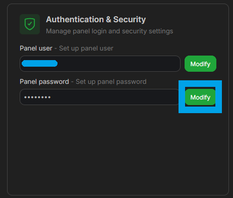
10. Enter the **old password first** (from the terminal), then enter the new password you want to set up for the panel, and click on **Confirm**.\
    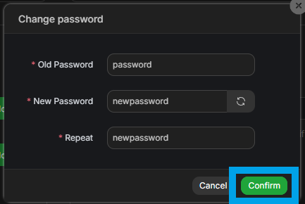
11. Login once again with both your **new username and password**.\
    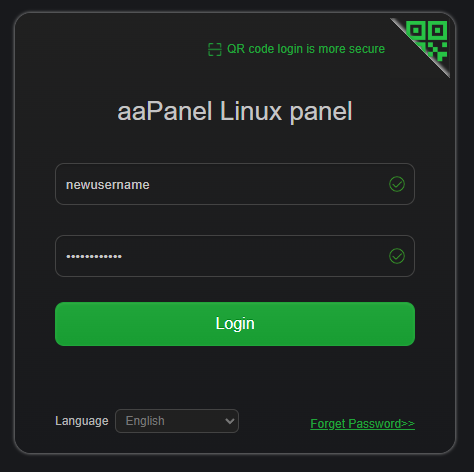
12. **_Congratultions!_** You have successfuly configured your aaPanel with your desired username and password!

### 7.6 aaPanel Website Creation.

It is now time to create our first website! Kind of. Let me explain.\
In **aaPanel**, we can create a website by allocating a web server. In our case, the web server we're using is **NGINX**. We're **not** making a website by the classic coding or one-click install, but we're letting aaPanel know that we have **one web server for ONE website**.\
If it's too confusing, I promise you'll get the concept while practicing.

**Question:** Why can't we create the website simply by uploading the webfiles that we have?\
**Answer:** Because aaPanel is not a "one-click install" all-solutions software. It is a control panel that allows us to **host multiple websites on multiple web server engines**. This is also something called _"Shared Hosting"_.\
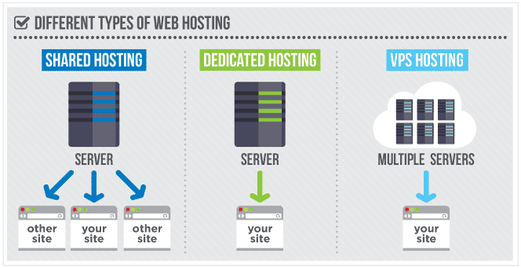

Let's go ahead and practice.

1. On the left-hand menu, select **Website**.
2. According to your needs, you will have to choose between _PHP Project_, _Node.js Project_, _Proxy Project_, _Go Project_ or _Python Project_.\
   I will personally choose **PHP Project** for this tutorial.\
   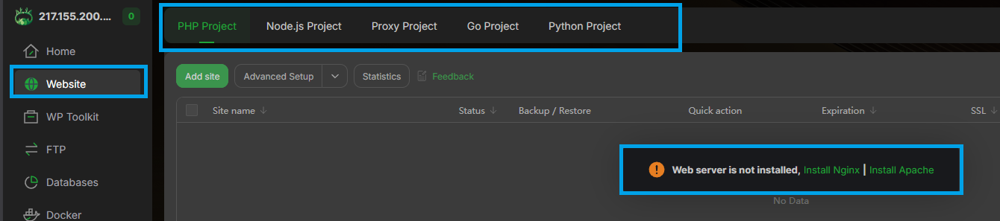
3. In the **PHP Project**, we have to choose between installing NGINX or Apache.
   > ⚠️ NOTE ⚠️ You must choose the engine that fits your goals. Long story short: **Apache** is the older, very flexible web server, while **NGINX** is the newer, very fast and lightweight one **_(Sounds pretty convenient for our Raspberry Pi project, right?)_**. Here's a [comparasion article](https://www.digitalocean.com/community/tutorials/apache-vs-nginx-practical-considerations) between the two of them.
4. For my needs, I will install **_NGINX_**. Click on **_Install NGINX_** button and then click on **_Quick install_** button. Make sure you are on the \*latest version available from the version drop menu.\
   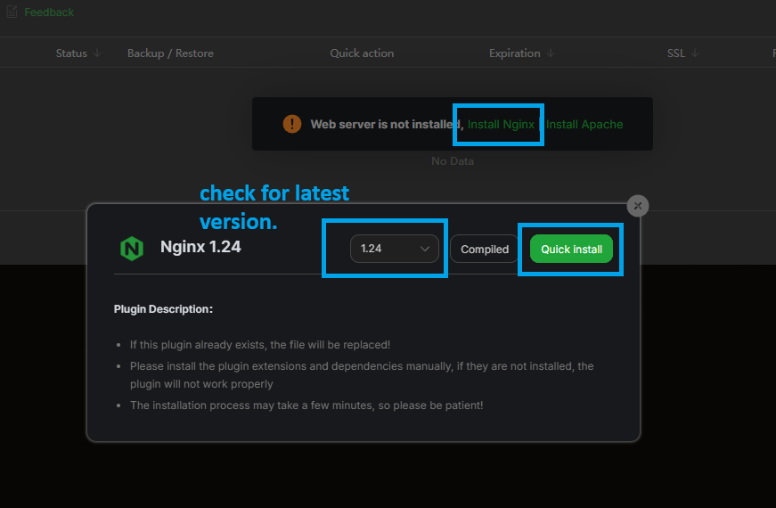
5. Wait for the NGINX to install. This will take around 10 minutes, so just be patient.\
   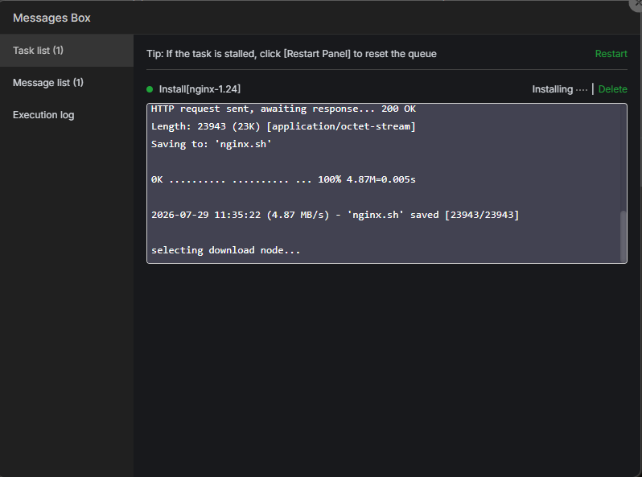
6. Once finished, you will now see a red button with the text **NGINX X.XX.X**. If you hover that button, you will see the following options: _Start / Restart / Reload / Alarm Setting_. That means NGX has been sucessfully installed, but it's not running - and that's okay, we need to manually start it.\
   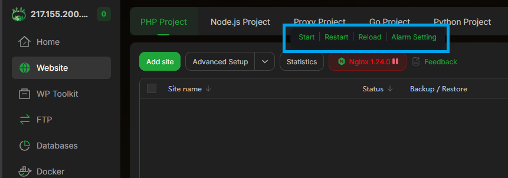
7. Click on "**Add site**".\
   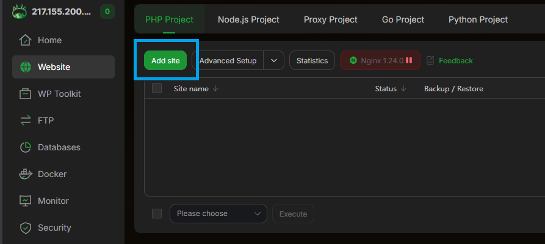
8. In the following screen, make sure you type the domain **and all subdomains** you want for your website. In my case, I want to use **michaelpanica.dev**, **www.michaelpanica.dev**, and **admin.michaelpanica.dev** to access the aaPanel remotely. **Make sure to also enable "Apply for SSL"**.

- For the **Description** and **Website Path** sections, let it complete automatically. Don't change anything.\
  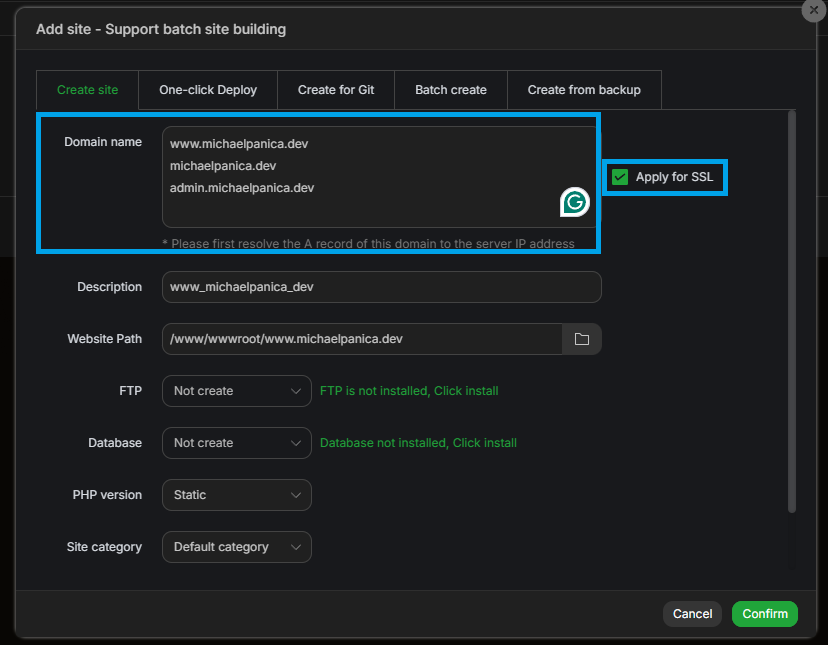
- You can create an **FTP (File Transfer Protocol)** to easily transfer files. You can do this in the following step:

9. **FTP (File Transfer Protocol**. Click on "FTP is not installed, Click to install".\
   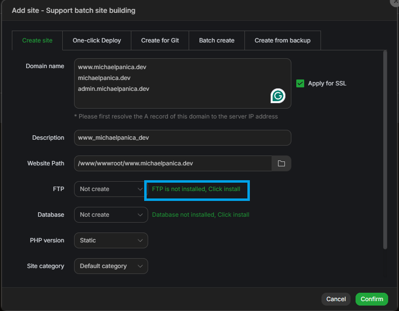
10. **FTP (File Transfer Protocol** Select the latest version of Pure-Ftpd and click **install now**.\
    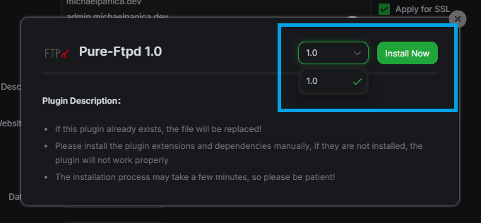
11. Wait for the installation to finish.\
    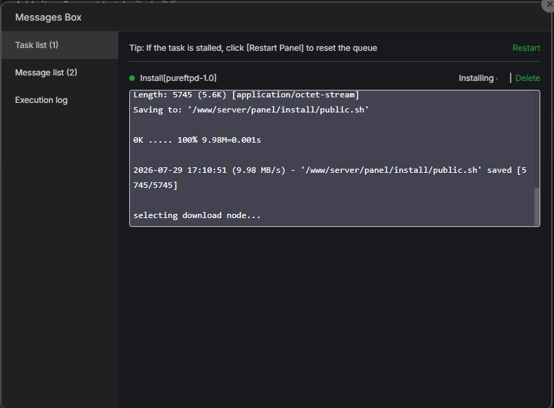
12. When finished, the Messages box will now be empty saying "Currently no tasks!". Close this menu and return to the previous menu.\
    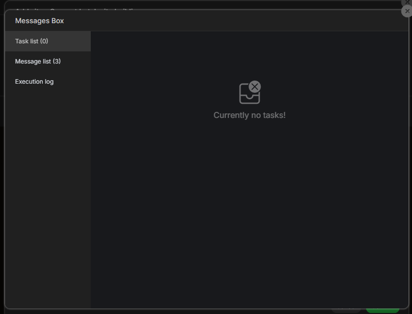
13. Here, on the "**FTP**" section, click on "**Not create**" and change it to "**Create**".\
    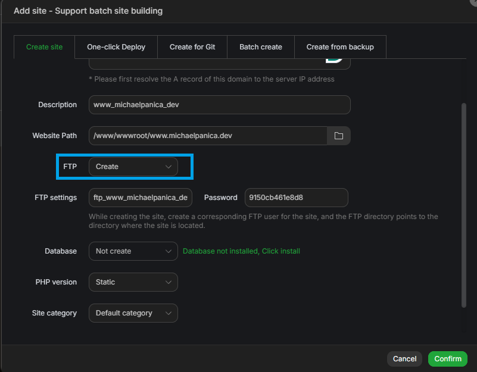
14. In **FTP Settings** and **Password** fields, change them to your likings. You will use these to login via FTP and transfer files.\
    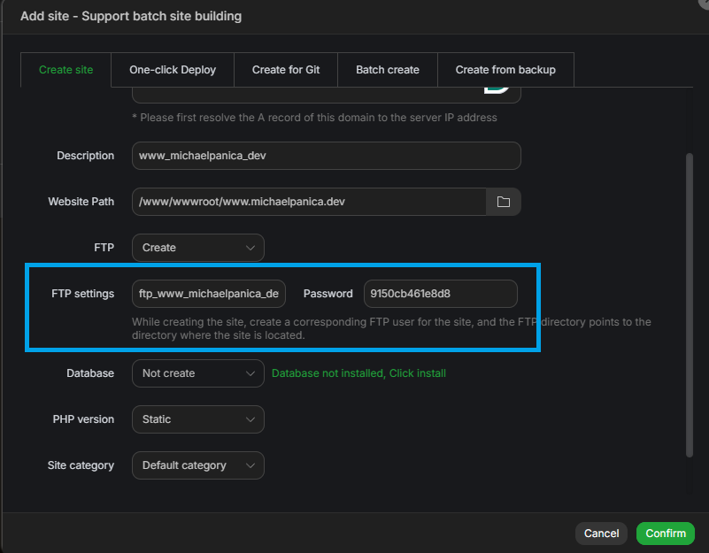
15. Make sure that:

- Database is not created (unless you need one).
- PHP Version is **Static**.
- Site Category is **Default Category**.
- Create HTML File is **enabled**.

16. Click on **Confirm** to create the first website.
17. When you see this message, that means you have created your first website! **Congratulations!**. The username and password are to connect to FTP.\
    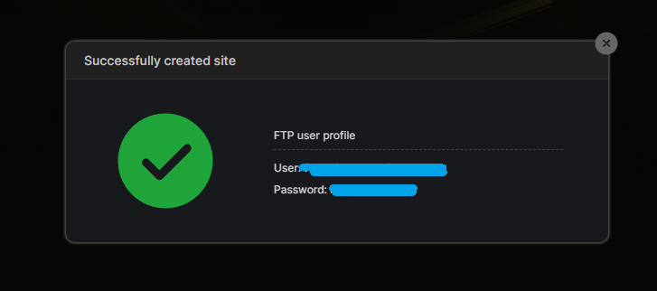

**Congratulations!** You have just installed your first website!

## 8. Port Forwarding

In order for our visitors to access our website, we must make the Raspberry Pi discoverable for WAN traffic. At the moment, it can only be accessed on our internal network. We can access the website by the **local IP** (192.168.1.1 for example), but we're not able to use the **public IPv4**.\
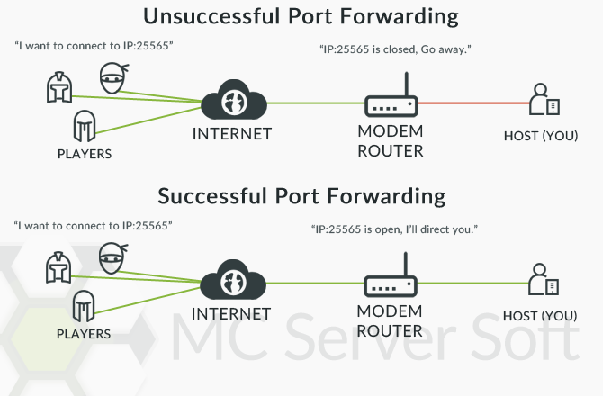

In order to do that, we have to do some tweaks in our Router to make the port reachable.

1. On Windows, open **Command Prompt**.
2. Type the following command and press **enter**:

```
ipconfig
```

3. Find **Default Gateway**, copy the IP starting with 192. and paste the IP in a browser window.
   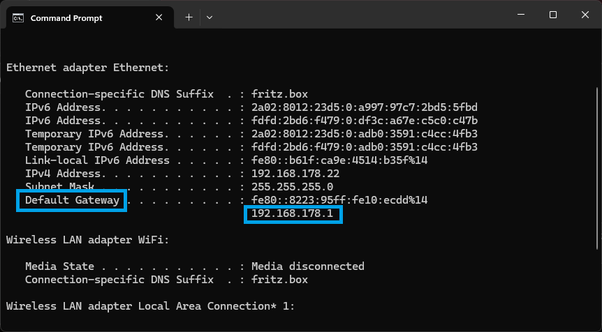
4. Login to your ISP Device (router) by using the password. Normally the password should be on the router itself. **Interface will look different depending on the manufacturer**.\
   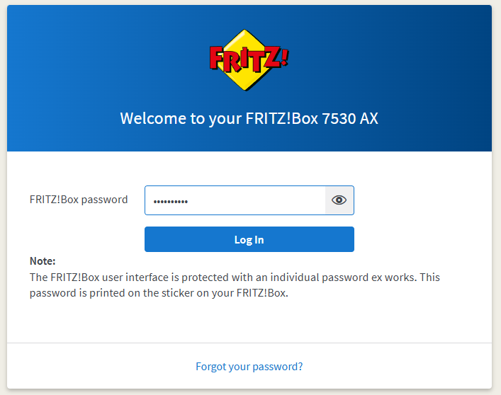
5. Navigate your router and find something port-forwarding related. If you can't find it, google your router model. For my **specific Fritz!Box model**, I can find Port Sharing (also called Port Forwarding) in **_Internet > Permit Access > Port Sharing_**.
   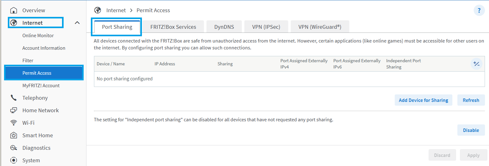
6. Click on **Add device for sharing**
7. In the Device menu, select your Raspberry Pi. The name will be the same as you gave it to the hostname in the OS Installation steps.\
   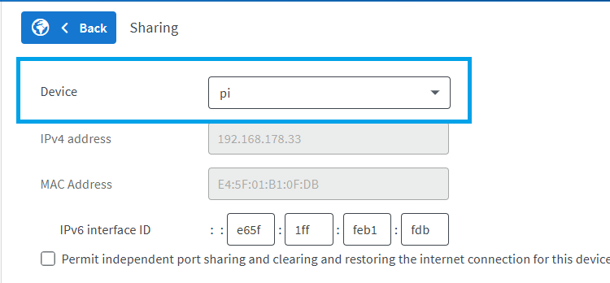
8. Click on **New Sharing**.
9. Select HTTP Server if it asks you for an Application, or simply type **80 - 80** for ports and make sure you have Enabled Sharing enabled.\
   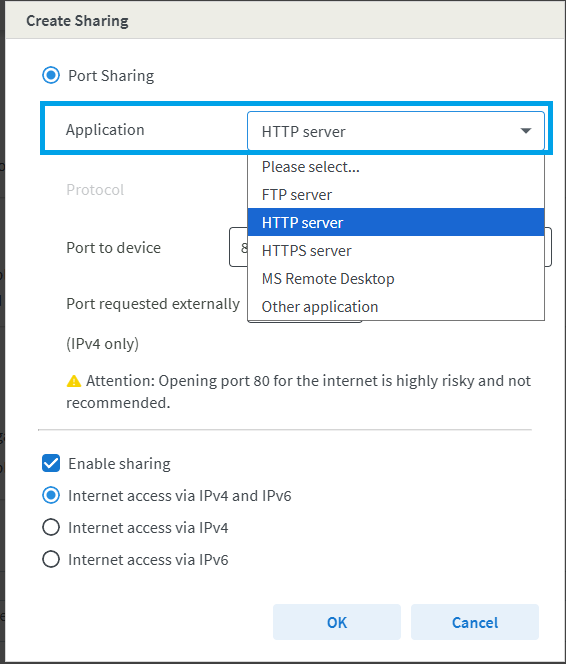
   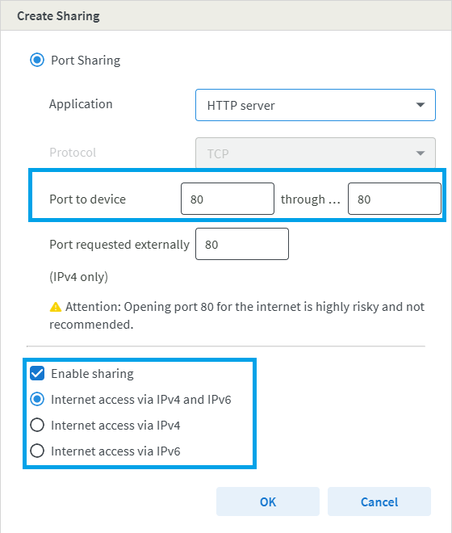
10. Click OK
11. Click on "New Sharing" once again to add another port and Protocol.\
    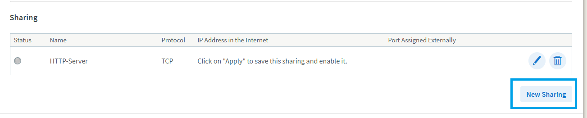
12. This time select HTTPS Server with the ports being **443 - 443**, Enabled Sharing enabled.\
    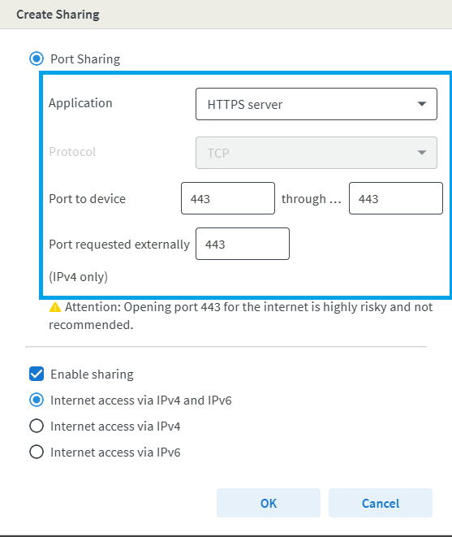
13. Click OK again.
14. Click on Apply.
15. Depending on your interface, there should be a sign the ports are up and running. For my device, I have these green lights next to the names that are telling me that they're open and can be accessed.\
    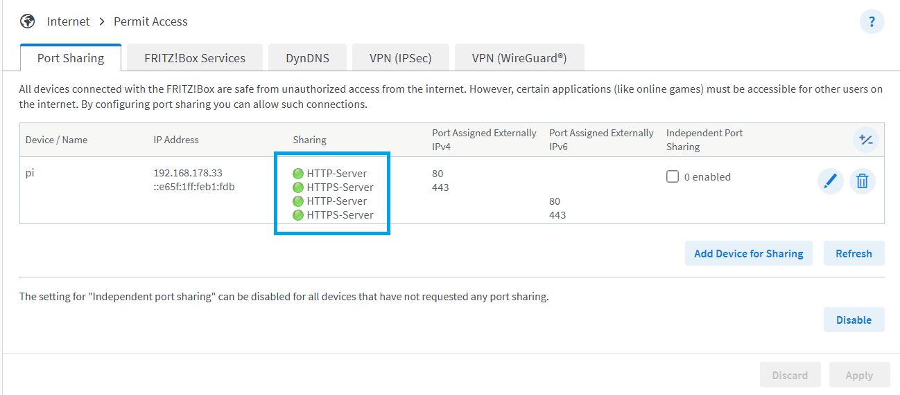
16. **Time to test if we're online.** Head over to [portchecker](https://portchecker.co/).
17. It should automatically take your Public (IPv4) IP. Type port 80 in the **Port number** tab and press **Check**. If you're getting a message saying "**Port 80 is OPEN**", then we're all good!\
    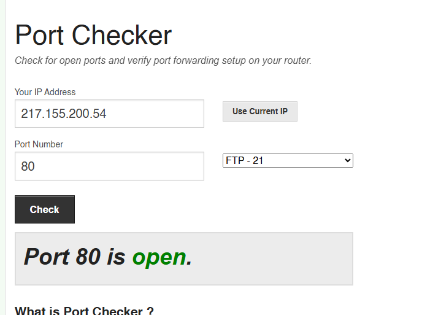
18. Open an **incognito browser page** and type your public IP.
19. You should now see the **Welcome to NGINX** page on your public IP.\
    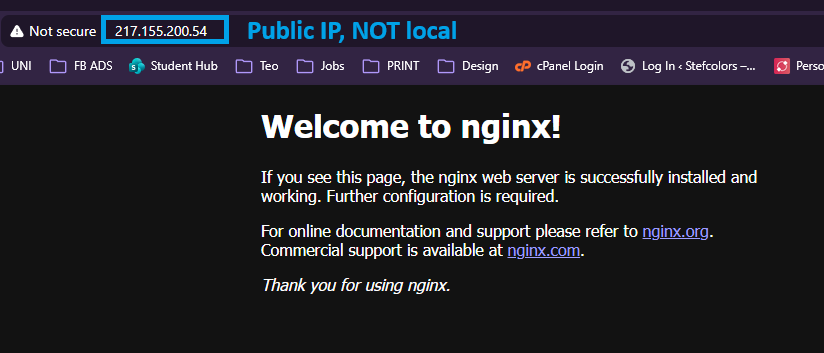
20. **Congratulations!** You have successfully opened the port for the webserver to be accessed online!\
    Another way of testing if your website is accessible online is to go to your public IP on your phone. Make sure you **disable wifi** and you have your mobile data on. Simply **open a browser, type your public IP and click enter**.\
    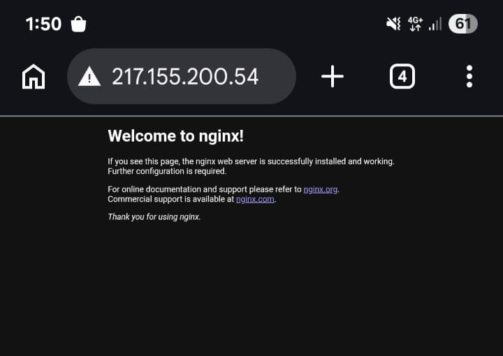

## 9. Domain Registration & DNS Records.

No one wants to access your website by typing the public IP. It is completely annoying and not practical. For this, we need something called a **domain**.\
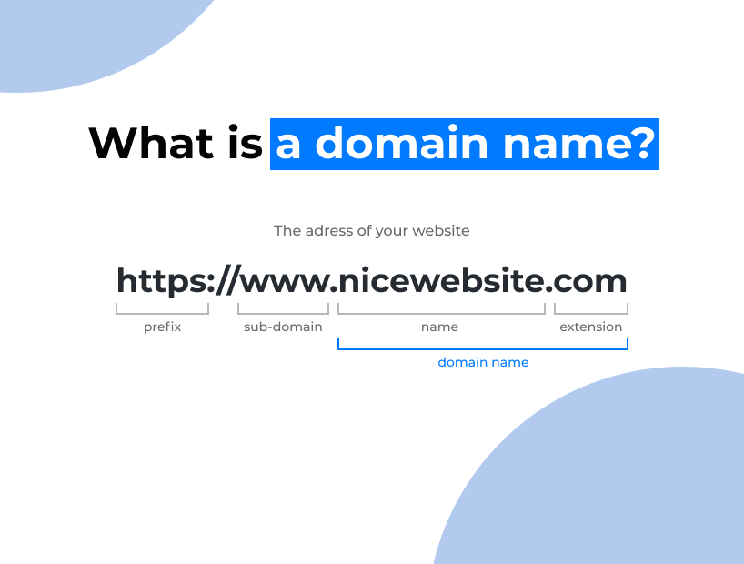

### 9.1 Domain - FAQ

- What is a Domain?
  > A domain name is the unique web address people type into an internet browser to visit a website, such as google.com or bbc.co.uk. It acts as an easy-to-remember label for a computer server's numerical IP address.
- Why does my website need a Domain?
  > Every computer on the internet has a unique IP address (like 192.0.2.1), which is hard for people to remember. A domain name translates that complex string of numbers into a simple name using the Domain Name System (DNS)
- Where can I get a domain?
  > You can buy domain names from ICANN-accredited domain registrars, with top choices including Porkbun, Namecheap, and Cloudflare Registrar.
- How much does a domain cost?
  > Standard domain names typically cost between £10 and £20 per year for registration and renewal. Promotional first-year offers can drop as low as £0.75 to £3.99, while specialized or premium extensions can cost significantly more. It really depends on the Domain Registrars and the desired extension (.com, .dev, .car, etc.)

**Popular Domain Registrars**

- **Porkbun**: Known for low, transparent renewal prices and free privacy protection.
- **Namecheap**: Offers affordable initial rates, bulk discounts, and a large suite of extra tools.
- **Cloudflare Registrar**: Sells domains at wholesale cost with zero markup, focusing heavily on security.
- **GoDaddy**: Best for searching through massive inventories or bidding on aftermarket/auctioned names.
- **Wix or Squarespace**: Ideal if you want to bundle your domain registration directly with an all-in-one website builder.

### 9.2 Domain Registration.

1. Find a Domain Registrar that offers you the desired extension for a price you're happy to pay.
2. For my case, I am using **Name.com**. They offer **free domains for students** (**_which is my case_**) - but check your University Student Benefits, as it might be different from University to University.
3. Create an accont on the platform.
4. Buy the desired domain.
5. Log into your account.
6. Select your domain and find a button called "**_Manage Domain_**".
7. Find **_Manage DNS Records_**. For my **_Name.com_** panel, it looks like this:
   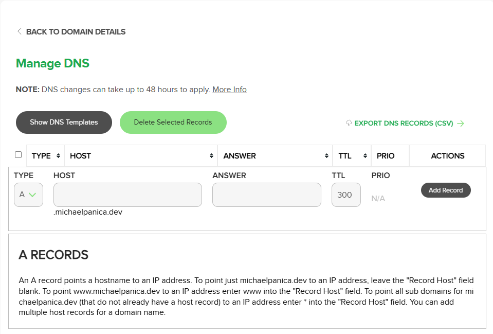
8. Open your Terminal and **_connect to your Pi_** by using **_SSH_**.
9. Type the following command:

    ```
    sudo bt 14
    ```
10. Click on the line that says this:
    ```
    aaPanel Internal Address: https://192.168.178.33:PORT/XXXXXX
    ```
    This should open a new browser where you can access your **_aaPanel_**. I recommend saving the page in a bookmark for easier access. 
11. Login by using your username and password. 
12. On the left side menu, copy your public IP.\
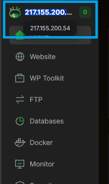\
13. Go back on your **_Manage DNS_** page and paste the IP at the **ANSWER** section. 
    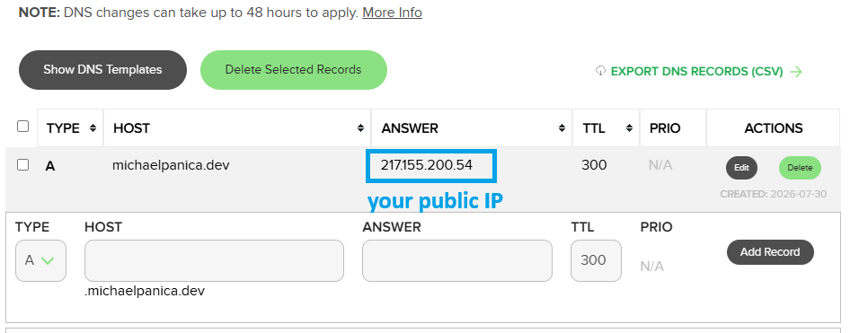
    - For the **_HOST_** section, you can leave it blank or type "**_@_**".
    - For **TTL** you can leave it to **300**.
    
14. Click "**ADD RECORD**".
15. Do the same step again, only that you must add ***www*** in the ***host*** section and public IP in the ***answer***.
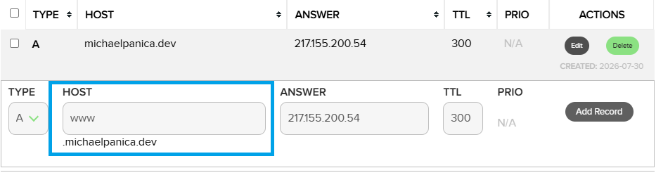 
16. Click "**ADD RECORD**".
>If you are trying to navigate to your website, you might get an error saying **the website refused to connect**. That is ***because you don't have an SSL installed*** on your domains. We'll have it fixed in the next 17-25 steps.
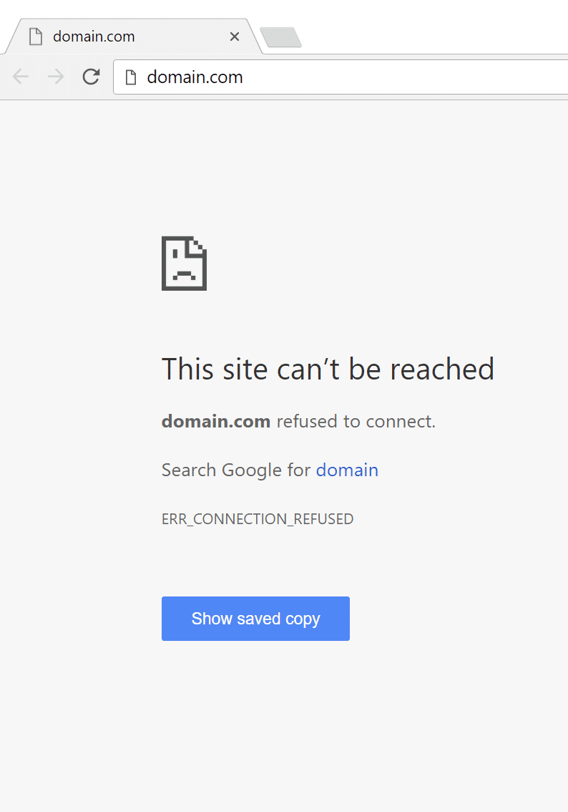 
17. Return to **aaPanel** and click on **Website**.
18. Start NGINX by pressing the **Start** button.
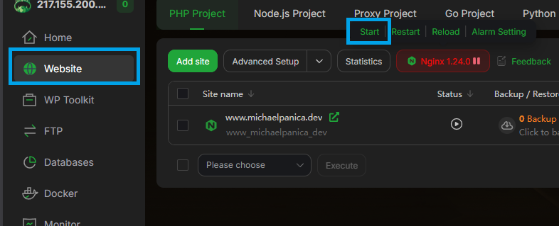
19. On the left-hand menu, click on **Domains**.
20. Create an account or login with your **Google Account**. 
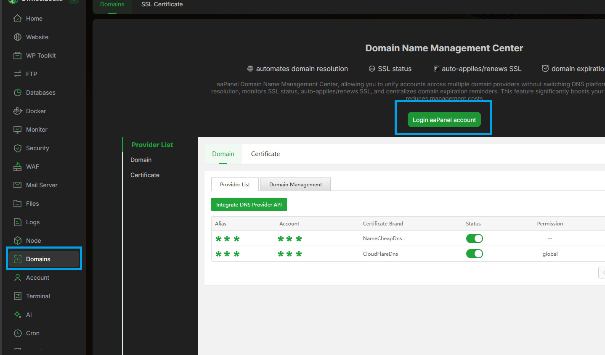\
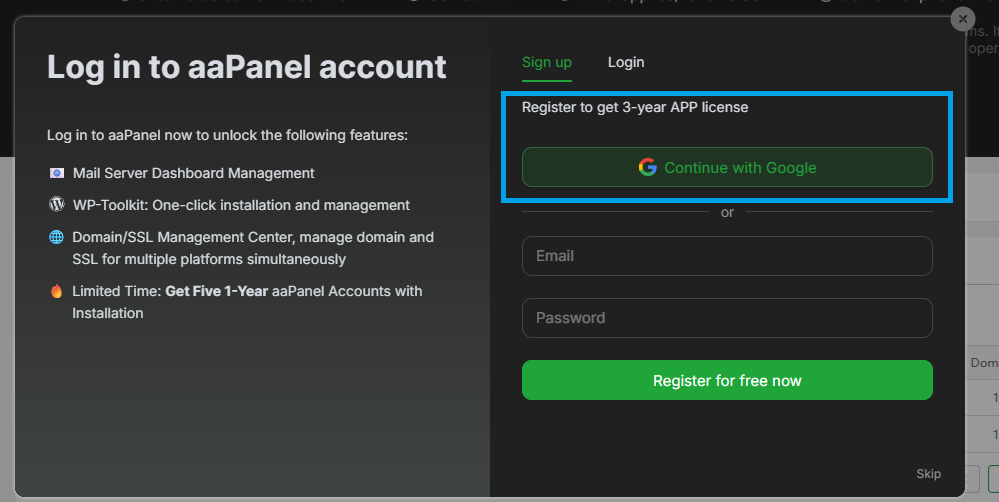
21. Head back to **Website** menu, click on **Not set**.
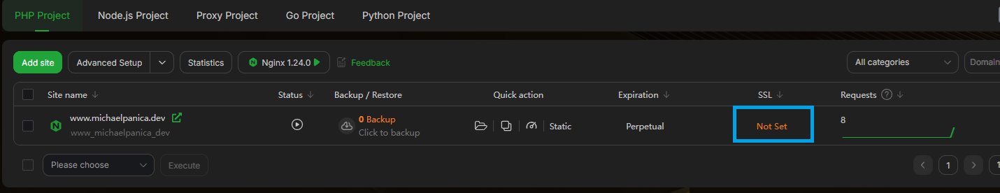
22. Click on **Lets Encrypt**, select **File Verification**, **select all the Domain names you have set up** (I recommend using both www and simple domain), then click **Apply**
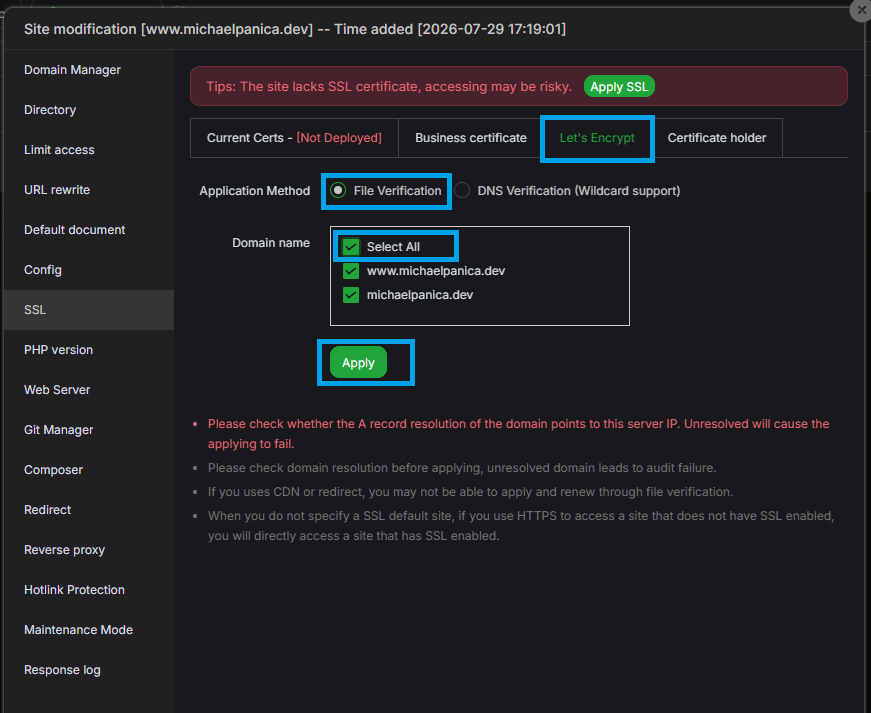
23. Wait for the installation. This will install SSL (**Secure Sockets Layer**) for your domains.
24. Once finished you will see the following screen. This means your domains are now secured and have an **SSL installed**. 
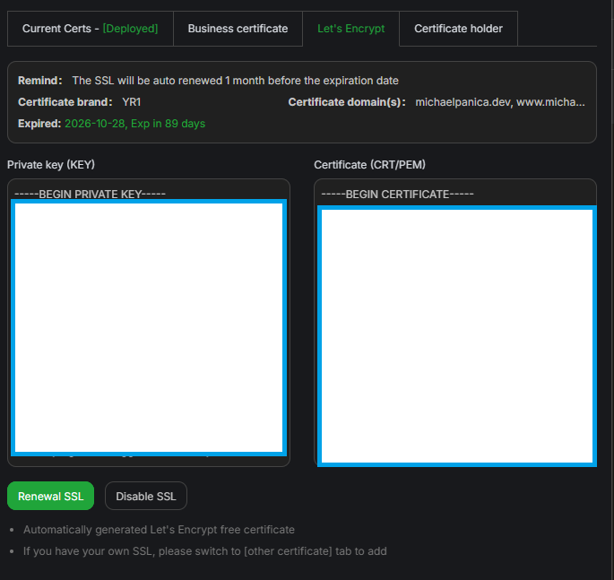
25. Close the menu. 
26. Head back to your website. You should now see this page. 
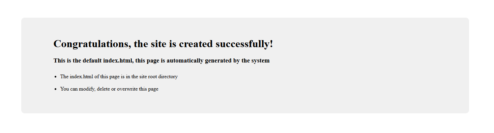
**Congratulations!** Your website is now up, running and accessible for everyone through your domain!  
>Make sure you verify your website like you did before. **Open an incognito window and/or use your mobile phone on mobile data**. 
### 9.3 Creating a Panel subomain. 
You'll probably want to access your panel from everywhere around the world, not just your local wifi. For this, we'll have to make a **new subdomain** and setup the DNS records for it as well.
1. Head to **Website** menu. 
2. Click on **Conf** button on the right side.
3. Click on **Domain Manager**
4. Add a new subdomain. This can be anything you wish. For my example, I will use **panel.michaelpanica.dev**. 
5. Click on **Add**.
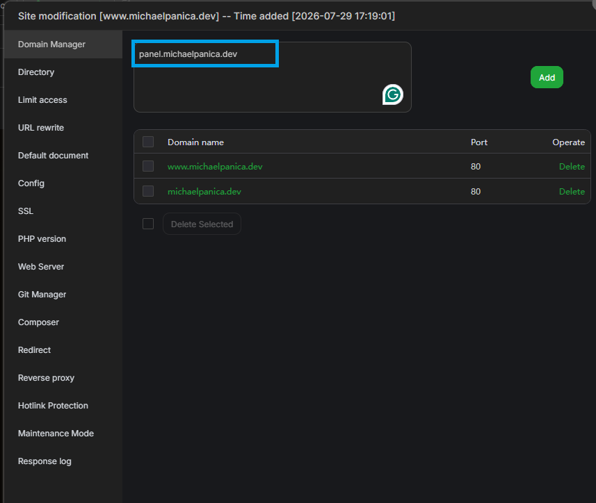
6. You should now see your new subdomain in the **Domain Name** list with the **port 80**. 
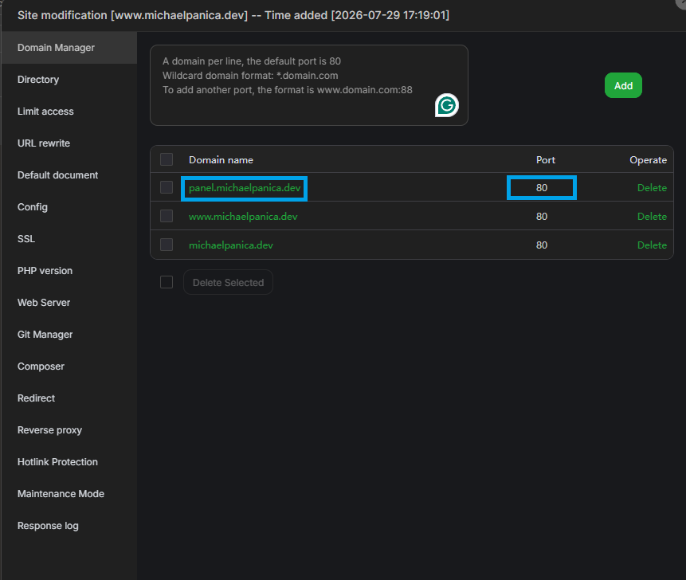
7. Head back to your **Domain Registrar** (**name.com in my case**).
8. Log into your account.
9. Find your domain and click on a button to manage it. 
10. Find "**Manage DNS Records**" button.
11. Select **Type A**, and in the **host** section type your subdomain. As mine is **Panel**, i will simply type **panel**. For the **Answer**, simply put your public IP again. 
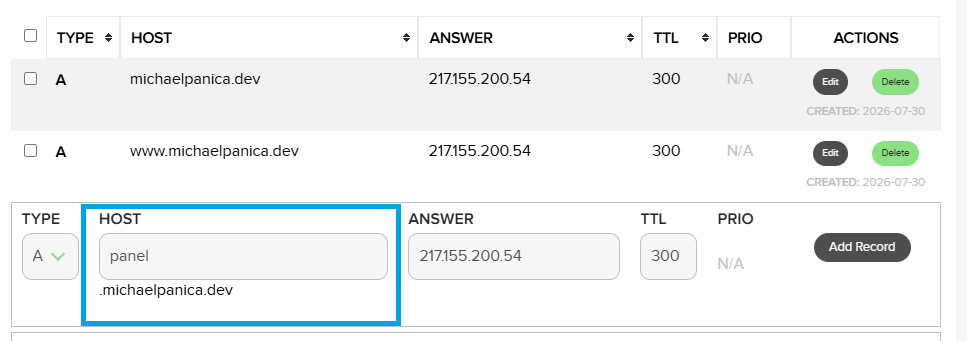
12. Click **Add Record**.
Now we need to install an SSL for the new subdomain that we have. 
13. Head back to **aaPanel**.
14. Find **Domains** in the left-hand menu.
15. Click on **SSL Certificate** > **Let's Encrypt**
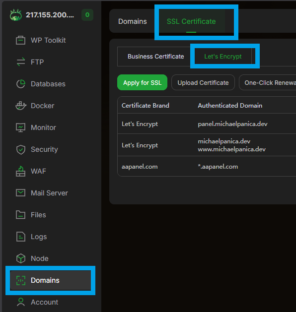
16. Find your **panel encryption** and click on **Manage**. 
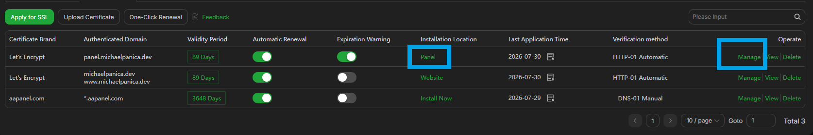
17. Click on **Panel** and click on **Deploy**
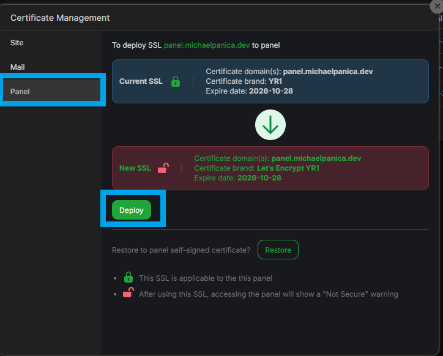
18. **Wait** for the SSL to be installed on the **panel subdomain**. If the page keeps loading, **refresh the page**.
19. Head over to the panel URL. You should now see receive a message that the page is safe. **If it still shows *unsafe*, clear the cache of your browser, close your browser and try again**.
20. Head over to **Settings** > **Network & Access**.
21. Enter the panel subdomain and click **Save**.
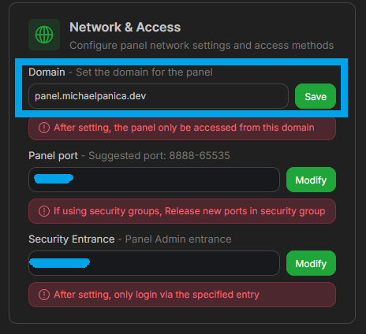
22. Your panel will now refresh.
23. Enter your panel URL in the **Your Domain Name** in the input box and click **Click to jump**.
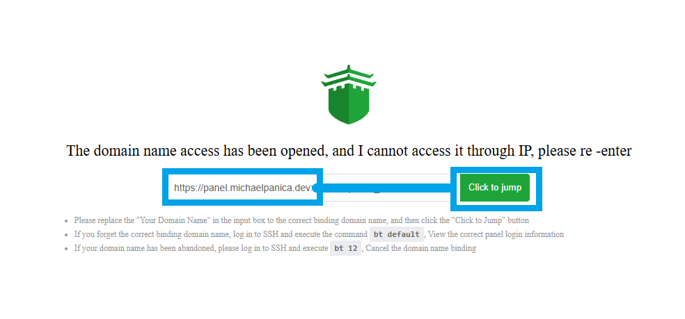

TO DO: Port Forward for the Panel Port.