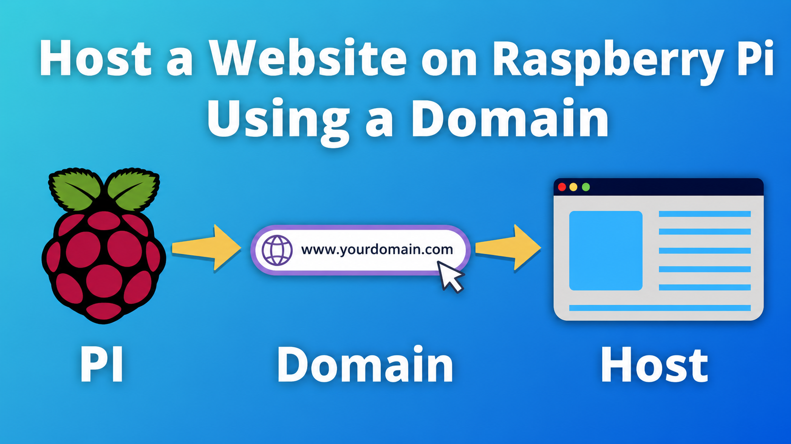
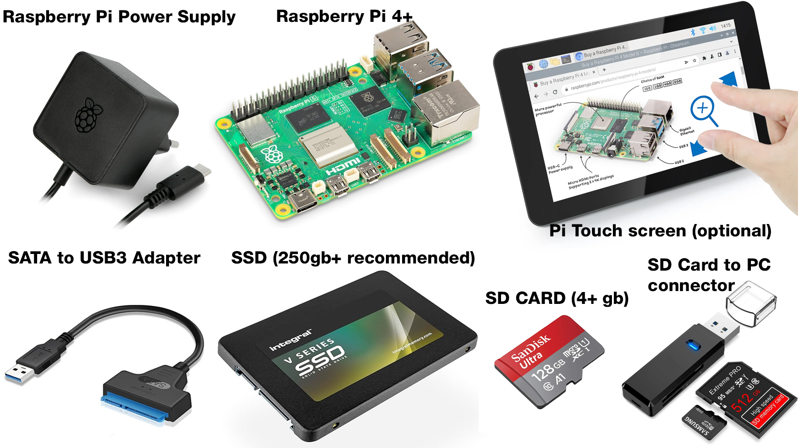
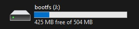
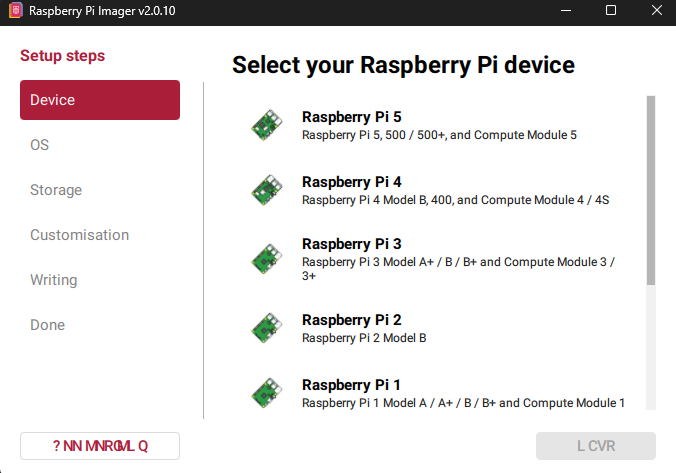
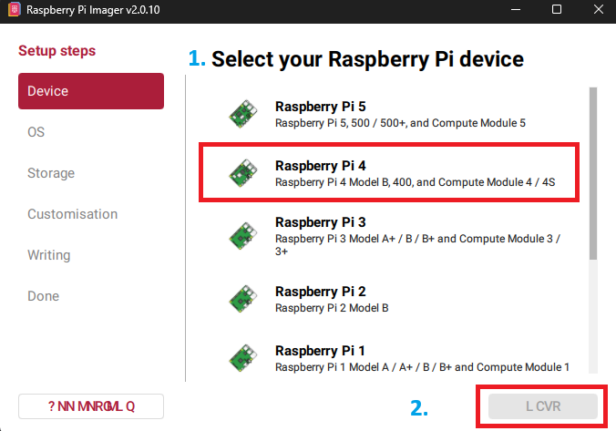
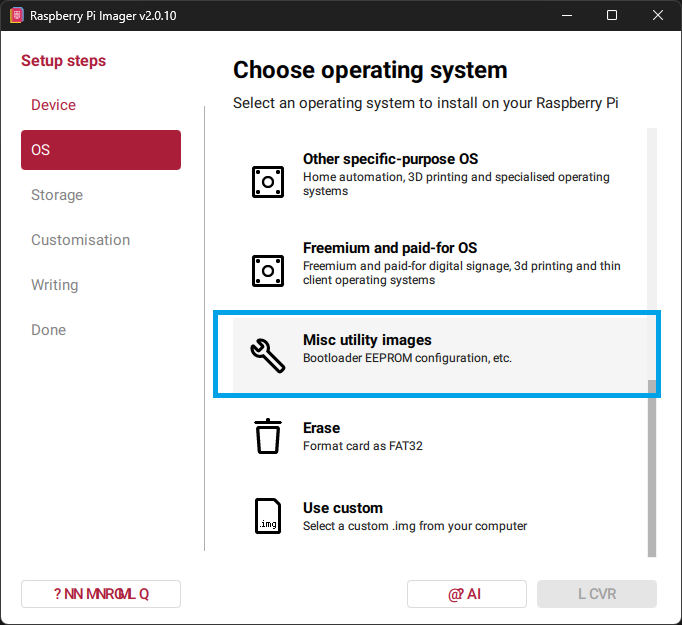
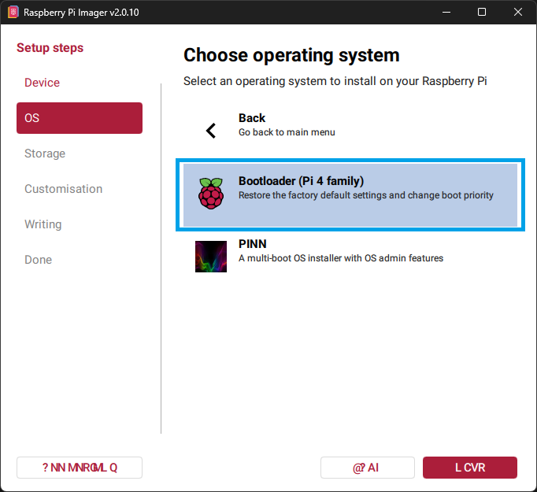
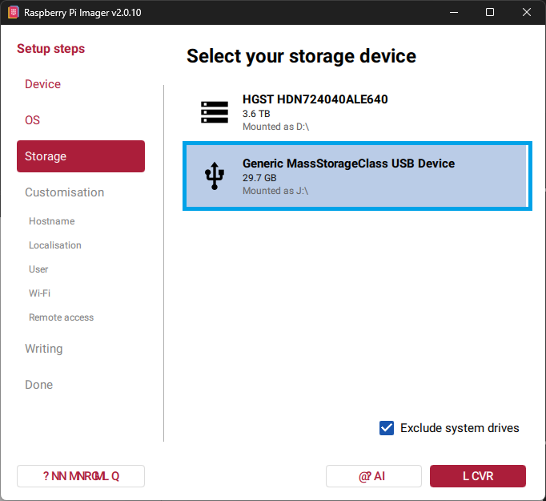
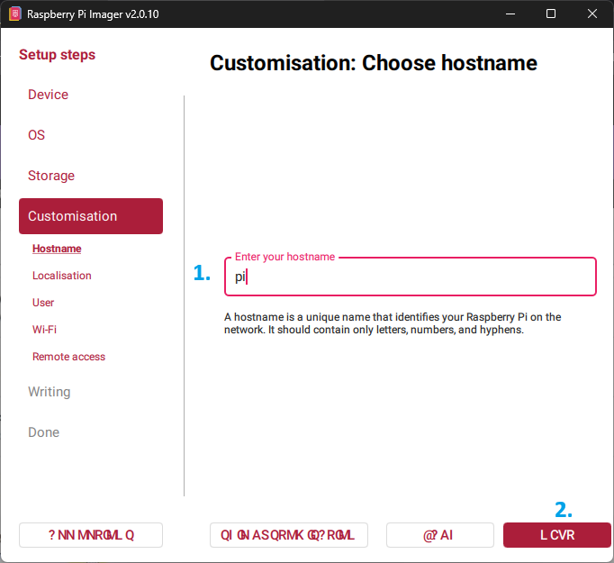

# This is a tutorial on how to host your own website on a Raspberry Pi using your own domain.
Did you ever asked yourself how to host a website without having to pay those expensives hosts and try to spend as less money as possible, without having to keep your computer on all day to host a website? \
If yes, then this page is for you.

## What will you learn from this? 
1. How to install Ubuntu on SSD by using SATA to USB3 Adapter.
2. Install NGINX on your Raspberry PI.
3. Install a control panel for your website.
4. How to point your Domain to your Raspberry Pi IP.
5. How to make your website public through port forwarding.
6. Secure both your website and your control panel with firewalls and protection.
7. Automate emergency notifications. If something happens with your host, panel, etc, you will get a notification on your phone via Telegram, Discord, Email, etc.

## FAQ:
```
Why can't I use an SD Card like all Pi users do? 
```
>Switching a Raspberry Pi from a microSD card to an SSD massively boosts read/write speeds, improves long-term reliability, and prevents data corruption during unexpected power loss. In other words, your SD Card may always corrupt unexpectedly and makes you lose all your work, and it's slower.

```
Is it worth it?
```
>If you don't want to spend 10£/month for a basic web host, yes. Unlike normal hosting, where you pay 10£/month for ONE website, with Raspberry Pi and NGINX you can host multiple websites without paying anything. (except for domains)

```
Do I need to know linux commands?
```
>Not necessarily. I highly recommend you learn ubuntu terminal commands for long-term education. Linux is a must-know skill that every developer should touch at some point. You can't do anything on your computer if you don't even know how to turn it on, right?


## Requirements:
1. A computer with internet access (can be both laptop and desktop).
1. A Raspberry Pi (preferably 4+. Anything under Pi 4 will have issues with SSDs).
2. SATA to USB3 Adapter.
3. Raspberry Pi Power Supply.
4. SSD (250+GB Recommended for long-term scalability).
5. SD Card (4GB+) - We won't need this for long.
6. SD Card to USB Adapter. There are many choices and models online, they are all the same, as long as they do the job.
5. Raspberry Pi 7" Touchscreen (optional, totally not needed for our project but useful if you want to have a weather station, Home Assistant Implementations etc.)


### Installation - Ubuntu OS on Raspberry Pi.
To install Ubuntu on your Raspberry Pi you will need:\
1. Raspberry Pi Imager. [Download from Official Website](https://www.raspberrypi.com/software/)
2. SATA to USB3 Adapter
3. SSD (250GB+ Recommended for scalability and huge websites with lots of images)

__INSTALLATION STEPS__
1. Download Raspberry Pi imager.
2. Install it.
3. Connect your SD Card to your computer.\
>In my case, the SD Card is mounted on (J:)\

4. Open Raspberry Pi Imager. \
You will now see this: 

> If you see random characters like mine (? NNMNROMLQ), just ignore them. I don't know why it looks like that, it might be from my side only.
5. Choose your device. In my case, I am using a Raspberry Pi 4, so I will chose the second option. 
6. Click Next (or LCVR in my case - don't ask, I dont know why it looks like this.)\

7. In the OS menu, we have to install a bootloader on the SD Card first. Scroll down until you find ***MISC UTILITY IMAGES*** and click on it. It should take you to the next section. If it doesn't, just click ***NEXT***\

8. Select ***Bootloader (Pi 4 Family)***
>It might say something else depending on the Pi you're using.\

9. Select the SD Card you have connected to your PC in ***step 3***, and click next.
>Since mine is in J: and it's a 32gb SD Card, I will select the second option.\

10. Enter the desired name for the Raspberry Pi. This can be any name you wish. Make sure you remember it and click ***next*** after you wrote it.\
